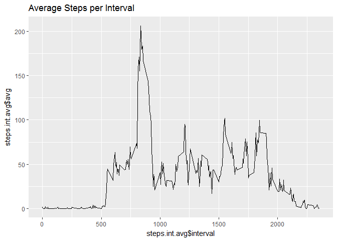

# steps_assignement
Mike Breen  
7 April 2017  


## R Markdown

This R markdown file is for the "Reproducable Research" Coursera on-line training. Week 1 asks the following questions and 
this markdown file will answer them, step by step, including the r code used.

## Section 1 - Loading and Preprocessing the Data
### 1. Load the data

The code below is used to read in the data file from the current R Home directory

```r
## Read the data from the home directory
filename <- "activity.csv"
steps <- read.csv(filename)
```
The code above reads the data in a assigns it to the "steps" data frame.

### 2. Process the data into a format suitable for your analysis

In this case converting the Data column into the correct date format via

```r
steps$date <- as.Date(as.character(steps$date))
```
## What is mean total number of steps taken per day?
### 1. Calculate the total number of steps taken per day

Better load the plotting and data wrangling (dplyr) libraries at this point

```r
## Load libraries
library(dplyr)
library(ggplot2)
```

Group the data by data and sum the steps values for each day (this uses dplyr)

```r
## Group the data by date
steps.date <- group_by(steps,date)
## Sum the steps per day
steps.day.total <- summarize(steps.date, sum=sum(steps))
```

### 2. Make a histogram of the total number of steps taken each day
In this case I used ggplot (i like the graphics more than the Base pacakge)

```r
## Plot a histogram
qplot(steps.day.total$sum,geom="histogram", binwidth = 1000, main = "Total Steps per Day")
```

<!-- -->

```r
ggsave("hist_steps.png")
```

```
## Saving 7 x 5 in image
```


### 3. Calculate and report the mean and median of the total number of steps taken per day

Pretty straighforward this, see the code below


```r
## Report the mean number of steps per day
print("Mean number of steps per day =")
```

```
## [1] "Mean number of steps per day ="
```

```r
print(mean(steps.day.total$sum,na.rm=TRUE))
```

```
## [1] 10766.19
```

```r
## Report the median number of steps per day
print("Median number of steps per day =")
```

```
## [1] "Median number of steps per day ="
```

```r
median(steps.day.total$sum,na.rm=TRUE)
```

```
## [1] 10765
```

## What is the average daily activity pattern?
### 1. Make a time series plot (i.e. type = "l") of the 5-minute interval (x-axis) and the average number of steps taken, averaged across all days (y-axis)

Group the original data by interval instead of date, then summarize by the average of each interval (mean)

```r
steps.int <- group_by(steps,interval)
steps.int.avg <- summarize(steps.int, avg=mean(steps, na.rm=TRUE))
```

Next plot the new dataframe (again using ggplot)

```r
qplot(steps.int.avg$interval,steps.int.avg$avg,geom="line", main = "Average Steps per Interval")
```

<!-- -->

```r
ggsave("Interval_steps.png")
```

```
## Saving 7 x 5 in image
```

### 3. Which 5-minute interval, on average across all the days in the dataset, contains the maximum number of steps?
Bit of subsetting required here...

```r
print("Interval with the maximum step (average):")
```

```
## [1] "Interval with the maximum step (average):"
```

```r
steps.int.avg[[which(steps.int.avg$avg == max(steps.int.avg$avg)),1]]
```

```
## [1] 835
```

## Are there differences in activity patterns between weekdays and weekends?
### 1. Create a new factor variable in the dataset with two levels indicating weekday or weekend

Right, so firstly pull out the weekday info using the weekdays() function

```r
steps <- mutate(steps, weekday=weekdays(steps$date))
```
Then replace the names with the characters "weekday" or "weekend"

```r
steps$weekday <- replace(steps$weekday, steps$weekday == "Monday", "weekday")
steps$weekday <- replace(steps$weekday, steps$weekday == "Tuesday", "weekday")
steps$weekday <- replace(steps$weekday, steps$weekday == "Wednesday", "weekday")
steps$weekday <- replace(steps$weekday, steps$weekday == "Thursday", "weekday")
steps$weekday <- replace(steps$weekday, steps$weekday == "Friday", "weekday")
steps$weekday <- replace(steps$weekday, steps$weekday == "Saturday", "weekend")
steps$weekday <- replace(steps$weekday, steps$weekday == "Sunday", "weekend")
```
Finally convert the new column vector "weekday" to a factor variable

```r
steps$weekday <- as.factor(steps$weekday)
```

### 2. Make a panel plot of the 5-minute interval and the average number of steps taken, across all weekday/weekend days. 

So need to regroup the data using a 2nd level "weekdays" then summarize using mean


```r
steps.week <- group_by(steps,weekday,interval)
steps.week.avg <- summarize(steps.week, avg=mean(steps, na.rm=TRUE))
```

Then plot (using ggplot) and facet based on the weekday factor


```r
ggplot(data = steps.week.avg, aes(x=interval,y=avg)) + geom_line() + facet_grid(weekday ~.)
```

<!-- -->

```r
ggsave("steps_weekday.png")
```

```
## Saving 7 x 5 in image
```


